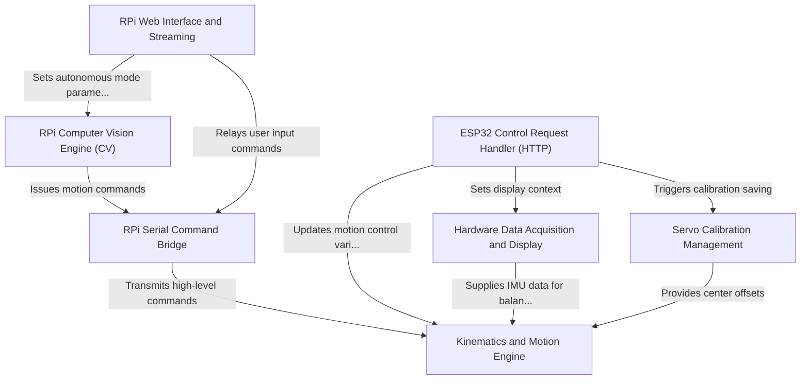

# Tutorial: WAVEGO

The WAVEGO project is an open-source robotic quadruped controlled by a dual architecture (RPi and ESP32). The ESP32 handles *low-level motion* using the **Kinematics and Motion Engine** (0), translating coordinate goals into required servo angles. The Raspberry Pi functions as the *high-level intelligence*, providing a **Web Interface** (6) for remote control and running the **Computer Vision Engine** (1) for autonomous functions like object tracking or line following, communicating all commands over a dedicated **Serial Command Bridge** (4).

## Visual Overview

## Chapters

1. [RPi Web Interface and Streaming
](01_rpi_web_interface_and_streaming_.md)
2. [RPi Computer Vision Engine (CV)
](02_rpi_computer_vision_engine__cv__.md)
3. [ESP32 Control Request Handler (HTTP)
](03_esp32_control_request_handler__http__.md)
4. [Servo Calibration Management
](04_servo_calibration_management_.md)
5. [RPi Serial Command Bridge
](05_rpi_serial_command_bridge_.md)
6. [Kinematics and Motion Engine
](06_kinematics_and_motion_engine_.md)
7. [Hardware Data Acquisition and Display
](07_hardware_data_acquisition_and_display_.md)

---