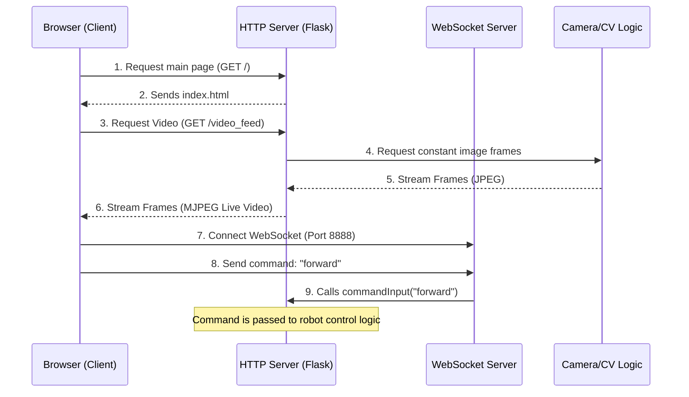

# Chapter 1: RPi Web Interface and Streaming

Welcome to the world of WAVEGO! Before your robot can walk, detect colors, or follow lines, we need a way for you to see what it sees and tell it what to do from the comfort of your computer or phone.

This chapter is all about setting up the crucial link between your remote device (the *client*) and the Raspberry Pi (RPi) acting as the robot's brain (the *server*).

## The Goal: Remote Control and Live View

Imagine you want to drive the WAVEGO forward using a simple button on a web page, and you want to see the live video stream instantly.

This core abstraction, the **RPi Web Interface and Streaming**, solves this by creating two separate, specialized communication channels on the RPi:

1.  **The Visual Interface (Flask):** Serves the main control webpage and delivers the continuous, low-latency video feed.
2.  **The Command Channel (WebSockets):** Provides a dedicated, high-speed line for sending real-time actions (like "Forward," "Stop," or changing a camera setting).

| Component | Technology Used | Purpose |
| :--- | :--- | :--- |
| **Interface & Video** | Flask (HTTP) | Hosting the webpage and streaming the camera view. |
| **Real-Time Control** | WebSockets | Sending instant commands from the browser to the robot. |

---

## 1. Setting up the Visual Interface (Flask)

Flask is a simple Python framework that lets the RPi act like a miniature website host. When you type the RPi's IP address into your browser, Flask is the service that answers and provides the control page (`index.html`).

### Serving the Web Page (`RPi/app.py`)

The main entry point, `app.py`, sets up the server. The job of the root path (`/`) is simply to deliver the control panel to your browser.

```python
# RPi/app.py (Simplified)
from flask import Flask, send_from_directory
# ... other imports ...

app = Flask(__name__)

@app.route('/')
def index():
    # This function finds the 'index.html' file 
    # located in the 'dist' directory and sends it to the browser.
    dir_path = os.path.dirname(os.path.realpath(__file__))
    return send_from_directory(dir_path+'/dist', 'index.html')

class webapp:
    def startthread(self):
        # Starts the Flask server running on the RPi's IP address
        app.run(host='0.0.0.0', threaded=True)
```

When you visit `http://[YOUR_RPI_IP]/`, this code runs and displays your control panel!

### Video Streaming (MJPEG)

Seeing the world through the robot's camera is achieved using a technique called **MJPEG (Motion JPEG) Streaming**.

Instead of sending one massive video file, we continuously send a rapid sequence of still JPEG images. The browser receives these images one after another, making it look like a smooth video.

In `RPi/app.py`, the video streaming uses two functions:

1.  `gen(camera)`: This is a Python **generator**. It constantly grabs the newest image frame from the camera hardware ([read more about the RPi Computer Vision Engine (CV)](02_rpi_computer_vision_engine__cv__.md) in the next chapter) and formats it for streaming.
2.  `video_feed()`: This Flask route `/video_feed` is the URL the browser uses to display the video inside an `` tag on the control page.

```python
# RPi/app.py (Video Streaming snippet)
def gen(camera):
    """Video streaming generator function."""
    while True:
        frame = camera.get_frame()
        # Special header format for MJPEG streaming
        yield (b'--frame\r\n'
               b'Content-Type: image/jpeg\r\n\r\n' + frame + b'\r\n')

@app.route('/video_feed')
def video_feed():
    """Route that serves the actual stream."""
    return Response(gen(camera),
                    mimetype='multipart/x-mixed-replace; boundary=frame')
```
The browser constantly connects to `/video_feed`, receiving the endless loop of picture data generated by `gen()`.

---

## 2. Real-Time Command Handling (WebSockets)

While Flask handles the webpage and video stream (HTTP traffic), we need something much faster and more responsive for controls. Imagine you press "Stop"—you don't want a delay!

We use **WebSockets** for this job, managed by the script `RPi/webServer.py`.

### Why WebSockets?

HTTP is "request-response." You ask for a page, you get it, and the connection closes. WebSockets establish a permanent, continuous, two-way connection. It's like having a dedicated phone line open between your browser and the RPi, ready to instantly relay data in either direction.

### Setting up the WebSocket Connection (`RPi/webServer.py`)

The `webServer.py` script starts a separate server that listens on a specific port (8888 in this project).

```python
# RPi/webServer.py (Simplified setup)
import asyncio
import websockets
import app 
# ... other imports ...

async def recv_msg(websocket):
	while True: 
		data = await websocket.recv() # Wait for data from browser
		
		# If the browser sends 'forward'...
		if isinstance(data,str):
			flask_app.commandInput(data) # Execute command!
			# (This commandInput function passes the action
            # to the camera/robot control logic)

if __name__ == '__main__':
    # 1. Start Flask (HTTP/Video)
	flask_app = app.webapp()
	flask_app.startthread()
    # 2. Start WebSocket Server
	start_server = websockets.serve(main_logic, '0.0.0.0', 8888)
	asyncio.get_event_loop().run_until_complete(start_server)
	asyncio.get_event_loop().run_forever()
```

When you click the "Forward" button on the webpage, your browser sends the simple text string `"forward"` over this persistent WebSocket channel. The `recv_msg` function immediately captures it and calls `flask_app.commandInput(data)` to execute the movement.

---

## 3. The End-to-End Communication Flow

When you connect to your WAVEGO, here is the sequence of events illustrating how the RPi handles both streaming and commands using the technologies we just discussed:



We see that the web interface uses a hybrid approach:

*   **HTTP (Flask):** Used for bulk data (the initial HTML page) and continuous, but slower, data streams (the video).
*   **WebSockets:** Used for minimal, instantaneous messages (control commands).

This dual-system ensures that the video stream doesn't slow down the response time for the robot's steering and movement controls.

## Conclusion

In this chapter, we learned that controlling WAVEGO remotely relies on two distinct Python services running on the RPi: Flask handles the visual interface and video streaming, while a separate WebSocket server ensures lightning-fast, real-time command transmission.

Now that we know how to get the camera data from the RPi to our browser, we need to understand how the RPi processes that visual information to make smart decisions, such as detecting objects or colors.

[Next Chapter: RPi Computer Vision Engine (CV)](02_rpi_computer_vision_engine__cv__.md)

---