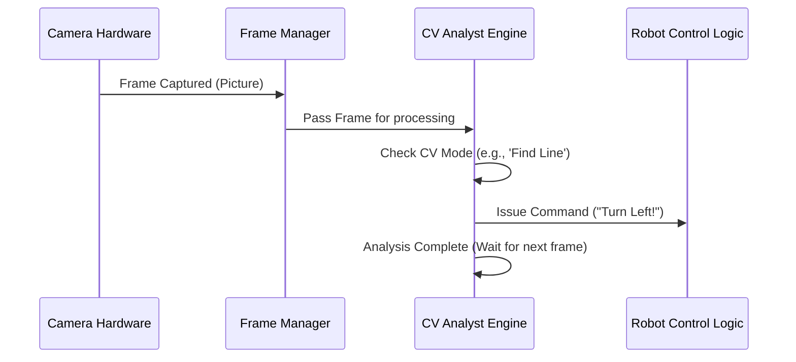

# Chapter 2: RPi Computer Vision Engine (CV)

In [Chapter 1: RPi Web Interface and Streaming](01_rpi_web_interface_and_streaming_.md), we successfully set up the link between your computer and the WAVEGO. We can now see the live camera feed and send instant commands like "Forward" or "Stop."

But what if you want the robot to think for itself? What if you want it to follow a path or track a specific color *without* you constantly sending commands?

This is where the **RPi Computer Vision Engine (CV)** comes in. It is the crucial system that allows the Raspberry Pi to analyze the images coming from the camera and use that analysis to make autonomous decisions.

## The Goal: Autonomous Operation

Imagine you place the WAVEGO on a floor with a thick black line. The goal of the CV engine is to enable **Line Following**:

1.  See the line.
2.  Determine if the robot is drifting left or right.
3.  Automatically issue a correction command ("Turn Right!") to stay on the line.

To handle this complex, continuous analysis, the CV engine relies on two main components:

| Component | Purpose | Analogy |
| :--- | :--- | :--- |
| **OpenCV** | The library that provides sophisticated visual analysis tools (eyesight). | The Textbooks & Formulas |
| **`CVThread`** | A dedicated, continuously running program that processes the frames and makes decisions. | The Specialist Analyst |

## 1. Introducing the CVThread (The Specialist Analyst)

Running advanced image analysis takes a lot of computing power. If we tried to do the analysis within the same process that handles video streaming, the video would become very slow and choppy.

To keep the live video smooth (as required by Chapter 1) while still performing analysis, the WAVEGO project uses **multi-threading**.

The `CVThread` is a separate, independent background process on the RPi. Its only job is to constantly grab the latest camera frame and check if any autonomous tasks (like line following or face detection) need to be done.

This setup ensures that:
1. The `BaseCamera` (Chapter 1) always has a fresh frame to stream to your browser.
2. The `CVThread` always has a fresh frame to analyze for autonomous control.

### The CV Analysis Loop

The `CVThread` only analyzes frames when an autonomous mode is active (e.g., when you click "Track Line" on the web interface).

Here is the simplified flow showing how a frame moves from the hardware to the autonomous decision maker:



## 2. Setting Up the CV Engine

The CV engine is started automatically when the video streaming begins within the file `RPi/camera_opencv.py`.

### A. Starting the Worker

The main video streaming function (`frames()`) first creates and starts the `CVThread` instance (`cvt`), giving the CV engine its own time slot to work in the background.

```python
# RPi/camera_opencv.py (Simplified startup)
# ... inside Camera.frames() ...

cvt = CVThread() # Create the analyst worker
cvt.start()      # Start the worker thread

while True:
    _, img = camera.read() # Get the raw picture
    
    # 1. Pass the image and the desired mode to the CVThread
    if Camera.modeSelect != 'none':
        cvt.mode(Camera.modeSelect, img)

    # 2. Draw any analysis data (lines, boxes) onto the image
    img = cvt.elementDraw(img) 

    # ... encode image for streaming ...
```

### B. Making the Decision (Find Line Example)

When you choose an autonomous mode (like `'findlineCV'`), the `CVThread` wakes up and runs the specialized function for that task.

Let's look at the core of the **Line Following** task, which uses OpenCV to find the center of the line.

```python
# RPi/camera_opencv.py (Simplified findlineCV logic)
def findlineCV(self, frame_image):
    # 1. Image preprocessing (OpenCV work)
    frame_findline = cv2.cvtColor(frame_image, cv2.COLOR_BGR2GRAY)
    # Convert image to pure black/white to find the line clearly
    retval, frame_findline = cv2.threshold(frame_findline, 0, 255, cv2.THRESH_OTSU) 

    # 2. Locate the center of the detected line on the screen
    self.center = calculate_line_position(frame_findline) # Imagine this function finds the line center

    # 3. Decision Making: Compare line center to target center (320 pixels)
    setCenter = 320 
    findLineError = 20 # Acceptable deviation

    if self.center > (setCenter + findLineError):
        robot.right() # Issue command to turn right
    elif self.center < (setCenter - findLineError):
        robot.left() # Issue command to turn left
    else:
        robot.forward() # Stay straight
        
    self.pause() # Analysis done, wait for the next frame
```

This tiny snippet is the entire brain of the line-following robot! It repeatedly performs these steps: See (image), Analyze (find center), Act (issue movement command).

### C. Different Modes of Operation

The CV engine is highly versatile. By changing the `CVMode`, the robot can run completely different analysis tasks on the same live video feed:

| CV Mode | Purpose of Analysis | Key Action |
| :--- | :--- | :--- |
| `findlineCV` | Look for contrasting lines or paths. | Issues turning/movement commands. |
| `findColor` | Search for a specific color (e.g., tracking a red ball). | Adjusts camera pan/tilt servos. |
| `faceDetection` | Identify human faces using pre-trained models. | Activates buzzer/lights (e.g., alert mode). |
| `watchDog` | Detects any motion within the frame. | Sends motion alerts/sounds alarm. |

## 3. Issuing Commands to the Robot

Once the `CVThread` makes a decision (e.g., "The line is too far left, so I must `turnRight()`"), it needs to tell the robot hardware to move.

It does this by calling standard robot movement functions (like `robot.right()`, `robot.forward()`, or `robot.buzzerCtrl(1, 0)`).

These functions do not directly talk to the motors. Instead, they format the instruction into a simple command string (like `TS` for Turn Stop or `MF` for Move Forward) and pass it to the command pipeline.

In the previous chapter, we saw how commands from the *web browser* were received. Now, commands generated by the *internal CV engine* use the same path to control the robot movement.

This command path is managed by the [RPi Serial Command Bridge](05_rpi_serial_command_bridge_.md), which we will explore fully in a later chapter.

## Conclusion

The RPi Computer Vision Engine (CV) is the core of WAVEGO's intelligence. By leveraging a dedicated worker thread (`CVThread`) and the power of OpenCV, the RPi continuously analyzes the live camera feed to perform complex tasks like line following and color tracking.

The result of this analysis is a simple movement command (`forward`, `left`, `right`) that is immediately injected into the robot's control system.

Now that the RPi can receive commands from both the user (via WebSockets) and its own brain (via CV), we need to understand how these commands get translated into actual motion by the lower-level hardware.

[Next Chapter: ESP32 Control Request Handler (HTTP)](03_esp32_control_request_handler__http__.md)

---
