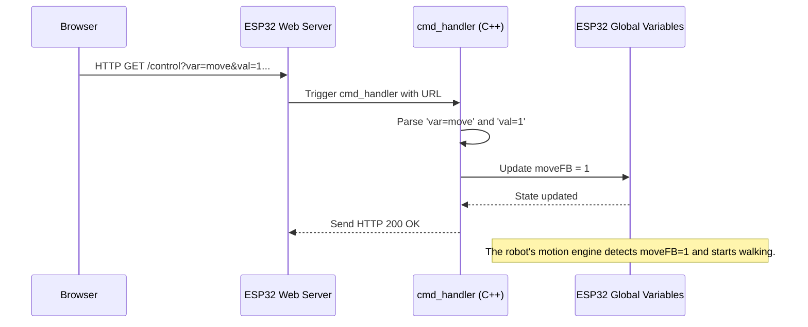

# Chapter 3: ESP32 Control Request Handler (HTTP)

In [Chapter 1: RPi Web Interface and Streaming](01_rpi_web_interface_and_streaming_.md), we learned how your computer talks to the Raspberry Pi (RPi). In [Chapter 2: RPi Computer Vision Engine (CV)](02_rpi_computer_vision_engine__cv__.md), we saw how the RPi can generate its own commands (like "Turn Left").

Now, we move down to the core hardware level: the **ESP32**. The ESP32 is a powerful microcontroller that acts as the robot's hardware interface—it controls the motors and hosts its own built-in web server and camera.

This chapter explains the **ESP32 Control Request Handler**, which is the mechanism that allows the ESP32 to receive simple, text-based commands and translate them directly into actions, especially when you are using the robot without the RPi.

## The Goal: Translating Web Clicks into Internal State

Imagine you connect directly to the ESP32's Wi-Fi network and open its control webpage. When you click the **FORWARD** button, the ESP32 needs to know exactly two things:

1.  That a control command has arrived.
2.  What that command specifically is (e.g., "Move Forward").

The **Control Request Handler** solves this by defining a specific "language" using HTTP GET requests (simple URL commands) and a single function, the `cmd_handler`, which acts like a receptionist who reads the instruction and updates the robot's internal state.

## 1. How the Command is Sent (HTTP GET)

When you click a button on the ESP32's embedded web interface (defined in `WebPage.h`), your browser sends a simple request containing the instruction encoded in the URL.

Every control action targets the `/control` route and uses three key pieces of information: `var`, `val`, and `cmd`.

Look closely at the `FORWARD` button code from the embedded web page:

```html
<!-- Snippet from WebPage.h -->
<button id="forward" 
    onmousedown="fetch(document.location.origin+'/control?var=move&val=1&cmd=0');"
    ontouchstart="fetch(document.location.origin+'/control?var=move&val=1&cmd=0');" 
    onmouseup="fetch(document.location.origin+'/control?var=move&val=3&cmd=0');" 
    ontouchend="fetch(document.location.origin+'/control?var=move&val=3&cmd=0');">
    FORWARD
</button>
```

When you press the button (onmousedown/ontouchstart), the browser sends the command:

`.../control?var=move&val=1&cmd=0`

This can be read as: "The variable (`var`) we are controlling is `move`, and we want the value (`val`) to be `1` (which means Forward)."

| Parameter | Meaning | Example |
| :--- | :--- | :--- |
| `var` | The type of control (e.g., `move`, `funcMode`, `sconfig`). | `move` |
| `val` | The specific action ID for that control type. | `1` (Move Forward) |
| `cmd` | Auxiliary data (often used for servo adjustment). | `0` |

## 2. The Command Handler (`cmd_handler`)

On the ESP32 side, the function `cmd_handler` (located in `app_httpd.cpp`) is the dedicated code block that listens to the `/control` route.

When a command (like `var=move&val=1`) arrives, the `cmd_handler` performs four steps:

1.  **Extract:** It reads the `var`, `val`, and `cmd` values from the incoming URL.
2.  **Translate:** It converts the text-based values (like the string "1") into actual numbers (`int val = 1`).
3.  **Route:** It uses an `if/else if` structure based on the `var` name to decide which system to affect (movement, functions, or servo calibration).
4.  **Update State:** It changes global variables that the ESP32's main motion engine checks constantly.

### Example: Processing a Movement Command

Let's look at the C++ code within `cmd_handler` that processes the **FORWARD** command (`var=move&val=1`):

```cpp
// Arduino/WAVEGO/app_httpd.cpp (Inside cmd_handler)

// Global variables defined elsewhere:
extern int moveFB; // 1=Forward, 0=Stop, -1=Backward
extern int debugMode;
extern int funcMode;

// ... Parsing var and val into integers ...

// Check if the variable is "move"
if (!strcmp(variable, "move")){
  debugMode = 0;
  funcMode  = 0;
  
  if (val == 1) {
    Serial.println("Forward");
    moveFB = 1; // Set the global state for movement!
  }
  else if (val == 3) {
    Serial.println("FBStop");
    moveFB = 0; // Stop
  }
  // ... (Other movement directions handled here) ...
}
```

When `val` is 1, the code sets the global variable `moveFB` to 1. This variable is the internal "flag" that signals to the entire robot system: **"GO FORWARD."**

| Command Value (`val`) | Action | Global Variable Change |
| :--- | :--- | :--- |
| 1 | Forward Pressed | `moveFB = 1` |
| 3 | Forward Button Released (Stop) | `moveFB = 0` |
| 2 | Turn Left Pressed | `moveLR = -1` |
| 6 | Turn Button Released (Stop) | `moveLR = 0` |

### The Control Flow Diagram

This diagram shows the journey of the "Forward" command, illustrating how the `cmd_handler` translates the simple URL text into an active robot instruction:



## 3. Handling Different Control Types

The `cmd_handler` isn't just for moving! It routes commands based on the `var` parameter to manage special behaviors and setup processes:

### A. Special Functions (`funcMode`)

The buttons for special actions like "Steady" or "HandShake" use `var=funcMode`. These commands update the global `funcMode` variable.

```cpp
// Arduino/WAVEGO/app_httpd.cpp (Inside cmd_handler)

// ...

// functions ctrl.
else if (!strcmp(variable, "funcMode")){
  debugMode = 0;
  funcMode = val;
  Serial.println(val);       
}
```
If you click "HandShake" (`val=3`), the `funcMode` variable is set to 3. The main program loop on the ESP32 constantly monitors this variable. When it sees `funcMode=3`, it runs the code sequence for the handshake action.

### B. Servo Calibration (`sconfig` and `sset`)

The bottom section of the ESP32 web page is dedicated to fine-tuning the 16 servos. This process uses `debugMode` to prevent accidental movement during configuration.

The commands for increasing/decreasing servo angles (`PWM0+`, `PWM0-`) use `var=sconfig`.

```cpp
// Arduino/WAVEGO/app_httpd.cpp (Inside cmd_handler)

// ...

// servo config. debugMode
else if (!strcmp(variable, "sconfig")){
  debugMode = 1;
  funcMode = 0;
  servoDebug(val, cmdint); // val is servo ID, cmdint is +1 or -1
}
else if (!strcmp(variable, "sset")){
  if(debugMode){
    servoConfigSave(val); // Save the current position as the new middle position
  }
}
```

When you click "PWM0+", the ESP32 enters debug mode, adjusts the pulse width modulation (PWM) for Servo 0, and updates the `CurrentPWM` array. If you then click "0\_SET," the `sset` block runs, saving that new adjusted position as the permanent center position for Servo 0 (a process detailed in [Chapter 4: Servo Calibration Management](04_servo_calibration_management_.md)).

## Conclusion

The **ESP32 Control Request Handler** (`cmd_handler`) is the essential link between the simple HTTP commands received over Wi-Fi and the robot's physical actions. It acts as a router, parsing the URL query (`var=X&val=Y`) and immediately updating global state variables (`moveFB`, `funcMode`, `debugMode`). These variables are then continuously read by the core motion logic to ensure the robot performs the requested movement or action.

Now that we know how to command the individual servos and save those adjustments, the next logical step is to dive deeper into how this crucial calibration data is managed and stored permanently.

[Next Chapter: Servo Calibration Management](04_servo_calibration_management_.md)

---
