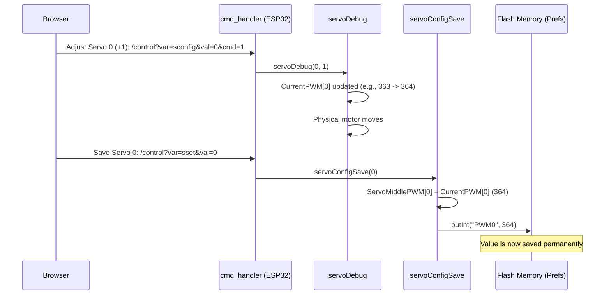

# Chapter 4: Servo Calibration Management

In [Chapter 3: ESP32 Control Request Handler (HTTP)](03_esp32_control_request_handler__http__.md), we saw how the ESP32 receives instant movement and configuration commands through its web interface. Among those commands were special instructions to manually adjust the robot's 16 servos.

But what happens after you spend an hour perfectly tuning your robot to stand straight? If the robot reboots, do those precise adjustments disappear?

This chapter introduces **Servo Calibration Management**, the critical system that ensures your robot remembers its precise mechanical setup, even after a power cycle.

## The Goal: Making the Robot Remember

When WAVEGO is built, slight differences in the motor casings and linkages mean that setting all 16 servos to their "default center position" often results in a crooked robot.

We need a way to find the *true* center position for each servo—the position where the leg stands perfectly level—and save that value permanently.

The Servo Calibration Management system uses the ESP32's non-volatile storage (called `Preferences`) to store these corrected center points, allowing the robot to use them immediately every time it turns on.

| Term | What it means | Analogy |
| :--- | :--- | :--- |
| **PWM Value** | The specific digital number (pulse width) that tells a servo motor where to move. | A precise angle measurement. |
| **`CurrentPWM`** | The temporary, actively adjusted PWM value used during calibration. | The current position you are trying out. |
| **`ServoMiddlePWM`** | The permanent, saved center position for a servo. | The "zero point" that must be remembered. |
| **`Preferences`** | The non-volatile storage area on the ESP32 chip. | The robot's long-term memory. |

## 1. The Calibration Process Flow

Calibration requires three main steps, all driven by the commands we learned about in Chapter 3:

1.  **Adjust:** Send commands to temporarily move a specific servo (`sconfig`).
2.  **Verify:** Visually check if the leg is now straight.
3.  **Save:** Command the ESP32 to write the current position to permanent memory (`sset`).

This process relies on two crucial C++ functions: `servoDebug` (to adjust the position) and `servoConfigSave` (to make it permanent).

### A. Adjusting the Servo (`servoDebug`)

When you use the web interface to click `PWM0 +` or `PWM0 -` (for Servo 0), you are calling `servoDebug`.

This command tells the ESP32: "Take the current position of Servo 0 and shift it by `+1` or `-1`."

```cpp
// Arduino/WAVEGO/app_httpd.cpp (Inside cmd_handler)

// ... when var=sconfig ...
else if (!strcmp(variable, "sconfig")){
    debugMode = 1;
    funcMode = 0;
    servoDebug(val, cmdint); // val=Servo ID, cmdint=+1 or -1
    // ... Serial prints showing current position ...
}

// Arduino/WAVEGO/ServoCtrl.h (Simplified)
extern void servoDebug(byte servoID, int offset){
  // Add the offset (+1 or -1) to the current position array
  CurrentPWM[servoID] += offset; 
  
  // Immediately send the new position to the physical motor
  pwm.setPWM(servoID, 0, CurrentPWM[servoID]);  
}
```

The `CurrentPWM` array holds the temporary position data. When you are adjusting, only this temporary value changes, and the motor moves immediately.

### B. Saving the Calibration (`servoConfigSave`)

Once you are satisfied that Servo 0 is straight, you click the "0\_SET" button on the web interface. This command is what activates the permanent memory saving function, `servoConfigSave`.

This function takes the perfectly adjusted value stored in the temporary `CurrentPWM` array and transfers it into the permanent `ServoMiddlePWM` array, then writes it to the ESP32's non-volatile storage (`Preferences`).

## 2. The Internal Memory Management

The persistent storage on the ESP32 is handled by the `Preferences` library (stored in `PreferencesConfig.h`).

### A. Saving the Data

When `servoConfigSave` runs, it does two critical things for the active servo (let's use Servo 0 as an example):

1.  It updates the `ServoMiddlePWM` array with the new value.
2.  It uses the `preferences.putInt()` function to save that value to a specific key (`"PWM0"`) in the flash memory.

```cpp
// Arduino/WAVEGO/PreferencesConfig.h (Simplified snippet)

extern void servoConfigSave(byte activeServo){
  // 1. Update the permanent array with the temporary value
  ServoMiddlePWM[activeServo] = CurrentPWM[activeServo];

  // 2. Save the value to flash memory (Preferences)
  if(activeServo == 0){
    // Save CurrentPWM[0] to the memory location named "PWM0"
    preferences.putInt("PWM0", CurrentPWM[activeServo]);
  }
  // ... else if for all 15 other servos ...
}
```

If the original default center for Servo 0 was `363`, and you adjusted it to `368`, the value `368` is now written to the internal flash memory under the name "PWM0".

### B. Loading the Data on Startup

The saving process is useless if the robot can't read the data back!

When the ESP32 first powers on and initializes, it runs a setup function called `preferencesSetup()`. This setup immediately calls `middleUpdate()`, which reads all 16 saved PWM values from the flash memory and loads them into the `ServoMiddlePWM` array.

```cpp
// Arduino/WAVEGO/PreferencesConfig.h (Simplified Startup)

void middleUpdate(){
  // Read the saved value for PWM0. If none is found, use the default value.
  ServoMiddlePWM[0] = preferences.getInt("PWM0", ServoMiddlePWM[0]); 
  // ... for PWM1, PWM2, ..., PWM15 ...
}

void preferencesSetup(){
  preferences.begin("ServoConfig", false); // Open the memory area
  middleUpdate(); // Load the saved values
  // Serial.println("Middle PWM Setup!");
}
```
Because the `middleUpdate` function runs *before* the robot starts moving or standing up, the robot uses the perfectly calibrated center points for all subsequent motion calculations (as discussed in [Chapter 6: Kinematics and Motion Engine](06_kinematics_and_motion_engine_.md)).

## 3. The End-to-End Calibration Flow

Here is how a single calibration command travels from your browser to permanent storage on the ESP32:



## Conclusion

The **Servo Calibration Management** module is essential for achieving precise, stable movement. It takes the manual adjustments made via the web interface and uses the ESP32's non-volatile `Preferences` storage to permanently store these customized center positions (`ServoMiddlePWM`). This ensures that regardless of mechanical variances, the robot can stand straight and use the corrected positions immediately upon boot.

We now understand how the ESP32 receives and remembers specific low-level configuration data. Next, we bridge the gap between the RPi's intelligence (Chapter 2) and the ESP32's movement commands (Chapter 3) to enable complex, continuous control.

[Next Chapter: RPi Serial Command Bridge](05_rpi_serial_command_bridge_.md)

---