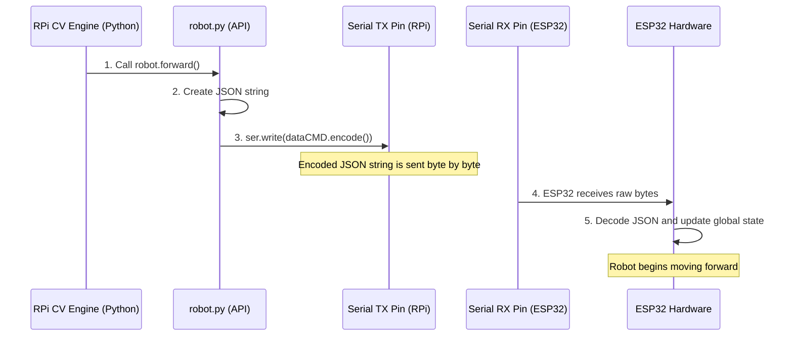

# Chapter 5: RPi Serial Command Bridge

In the previous chapters, we established two very important things:

1.  The Raspberry Pi (RPi) can decide what the robot should do, either based on your commands from the web [Chapter 1: RPi Web Interface and Streaming](01_rpi_web_interface_and_streaming_.md) or its own intelligence [Chapter 2: RPi Computer Vision Engine (CV)](02_rpi_computer_vision_engine__cv__.md). These decisions are expressed as Python function calls, like `robot.forward()`.
2.  The ESP32 is the low-level hardware brain that physically controls the motors and knows how to execute movement commands, especially when they arrive in a structured format [Chapter 3: ESP32 Control Request Handler (HTTP)](03_esp32_control_request_handler__http__.md).

But how do these two separate brains—the RPi running Python and the ESP32 running C++—actually talk to each other quickly and reliably?

The answer is the **RPi Serial Command Bridge**. It is the dedicated translator and physical messenger service that ensures every high-level Python decision is immediately executed by the low-level ESP32 motion controller.

## The Goal: Bridging the Language Gap

Imagine the RPi speaks "High-Level Python" and the ESP32 speaks "Low-Level Hardware." They need a shared language and a reliable phone line.

The Serial Command Bridge solves this by using three core concepts:

| Concept | Description | Analogy |
| :--- | :--- | :--- |
| **The Messenger** | The `robot.py` file, which contains all the Python functions (`forward`, `left`, etc.). | The person writing the letter. |
| **The Translator** | **JSON** (JavaScript Object Notation), a simple, standardized text format. | The standardized envelope and address structure. |
| **The Phone Line** | The physical **Serial Connection** (`/dev/ttyS0`), a dedicated wire between the RPi and the ESP32. | The dedicated, high-speed phone line. |

## 1. The Python Control API (`robot.py`)

Every function call you make to control the robot, whether through the web interface or the CV engine, passes through the `RPi/robot.py` file. This file acts as the official application programming interface (API) for the robot's movement.

If you want the robot to move forward, you simply call:

```python
# A simple, high-level command
import robot
robot.forward()
```

The simplicity of this command hides the complex communication required beneath it. `robot.py` is responsible for translating this simple instruction into something the ESP32 can understand.

## 2. Translating to JSON (The Standardized Envelope)

The ESP32 is expecting commands in a specific format, similar to the `var=move&val=1` structure we saw in Chapter 3. For the serial bridge, we use **JSON** to structure this information cleanly.

The `robot.py` file uses Python's built-in `json` library to serialize (convert to a string) a Python dictionary that holds the command data.

Let's look inside the `forward()` function to see this process:

```python
# RPi/robot.py (Inside the forward function)
import json

def forward(speed=100):
	# 1. Create a Python dictionary (the command content)
	command_data = {'var':"move", 'val':1} 
    
	# 2. Convert the dictionary into a standardized JSON string
	dataCMD = json.dumps(command_data) 
    
    # dataCMD now looks like: '{"var": "move", "val": 1}' 
    # This is the message ready to send!
	
	# 3. Send the message (Next Step)
	# ser.write(dataCMD.encode()) 
	print('robot-forward')
```

Why use JSON? It’s universal and easy for both Python and C++ (on the ESP32) to read and parse. It guarantees that the command structure is always consistent.

### Command Mapping Table

Every Python function is mapped to a unique JSON structure:

| Python Function | JSON `var` | JSON `val` | ESP32 Action |
| :--- | :--- | :--- | :--- |
| `forward()` | `"move"` | `1` | Start forward gait cycle. |
| `stopFB()` | `"move"` | `3` | Stop forward/backward movement. |
| `lightCtrl('blue', 1)` | `"light"` | `1` | Turn on blue LED. |
| `handShake()` | `"funcMode"` | `3` | Execute the handshake routine. |

## 3. The Physical Bridge: Serial Communication

Once the message is translated into the JSON string (`'{"var": "move", "val": 1}'`), it must be physically transmitted to the ESP32. This is done via the **Serial Port**.

The serial port is a direct, dedicated physical connection between the RPi and the ESP32 hardware. On Linux systems like the RPi, this port is designated as `/dev/ttyS0`.

### A. Setting up the Connection

The communication is set up once when the `robot.py` module is first initialized:

```python
# RPi/robot.py (Setup)
import serial

# Initialize the serial connection
# /dev/ttyS0 is the specific wire link
# 115200 is the communication speed (baud rate)
ser = serial.Serial("/dev/ttyS0", 115200) 
```

### B. Sending the Command

To send the translated JSON command, we use the `ser.write()` function. Since serial ports typically transmit raw bytes, we must convert the Python string into bytes using `.encode()`.

```python
# RPi/robot.py (Sending the command)

def forward(speed=100):
    # ... JSON conversion happens here ...
    
    # 3. Send the command string, converted to bytes, 
    # over the physical serial line.
    ser.write(dataCMD.encode())
```
This final step pushes the raw command data directly into the wire connecting the two chips.

## 4. The End-to-End Serial Command Flow

This diagram illustrates the full journey of a command, from a simple Python function call on the RPi to the actual bytes reaching the ESP32:



On the ESP32 side, the chip is continuously listening to the serial port. When the data arrives, it uses a JSON parsing library (like *ArduinoJson*) to quickly convert the incoming string (`'{"var": "move", "val": 1}'`) back into structured variables (`var='move'`, `val=1`).

The moment the ESP32 successfully decodes `var='move'` and `val=1`, it updates its internal state variables, triggering the motion engine (as detailed in [Chapter 6: Kinematics and Motion Engine](06_kinematics_and_motion_engine_.md)) to start the movement.

## Conclusion

The **RPi Serial Command Bridge** is the reliable, high-speed communication backbone between the Raspberry Pi's intelligence and the ESP32's motor control abilities. By standardizing commands into JSON and transmitting them instantly over the dedicated serial connection (`/dev/ttyS0`), we ensure that complex Python logic is immediately translated into physical action, allowing for real-time control and autonomous movement.

Now that we understand how the RPi can command the ESP32, the next logical step is to explore how the ESP32 translates those simple commands (like "forward") into the precise, complex calculations needed to move 16 individual servos in perfect coordination.

[Next Chapter: Kinematics and Motion Engine](06_kinematics_and_motion_engine_.md)

---