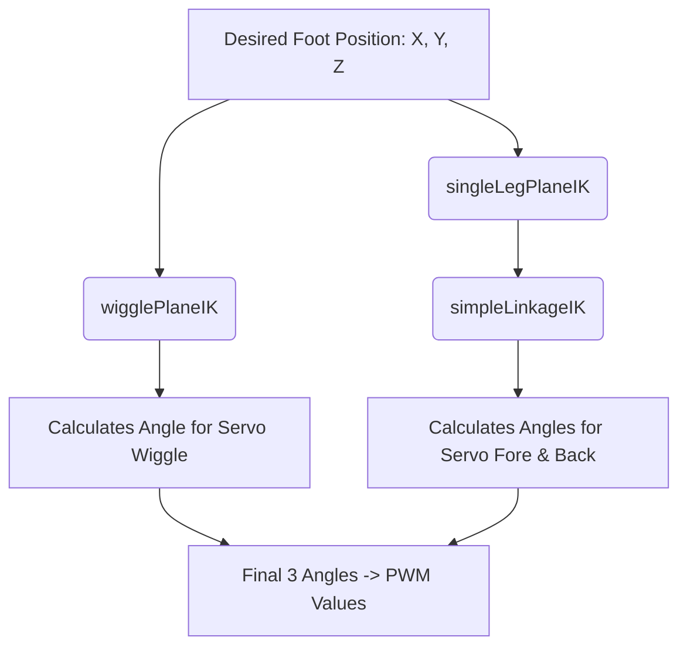
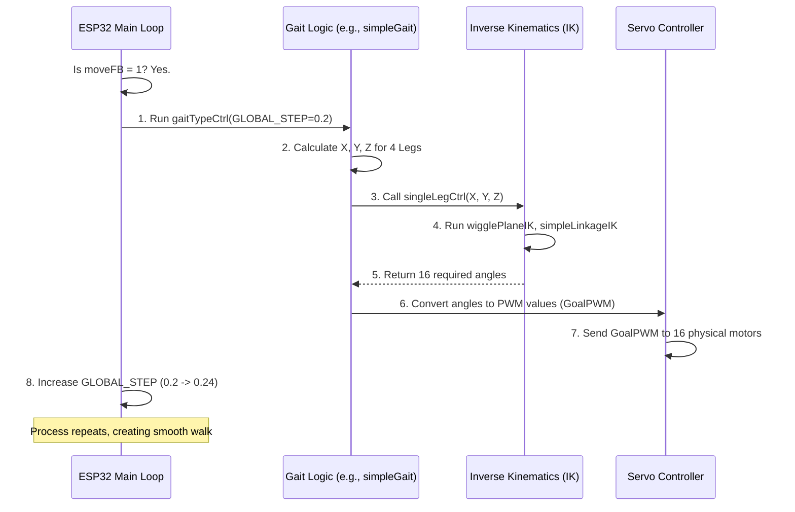

# Chapter 6: Kinematics and Motion Engine

In [Chapter 5: RPi Serial Command Bridge](05_rpi_serial_command_bridge_.md), we learned that the Raspberry Pi can send simple instructions, like `"move forward"`, to the ESP32 over a serial connection.

The ESP32 receives this command and sets an internal variable: `moveFB = 1` (Move Forward).

But here is the central challenge: **"Move Forward" is a human concept, not a motor command.** To walk, WAVEGO must coordinate 16 individual motors (3 per leg, plus 4 extra for leg rotation) simultaneously and smoothly, without falling over.

The **Kinematics and Motion Engine** is the core mathematical brain on the ESP32 that solves this problem. It takes a simple movement goal and translates it into hundreds of precise angle adjustments (PWM values) for the servos every second.

## The Goal: Translating X, Y, Z to Angles

Imagine you want a robot foot to land exactly 50 millimeters (mm) forward and 95 mm down from its starting point.

*   **Your Brain (High-Level):** Needs X=50, Y=95.
*   **The Robot (Low-Level):** Needs Angle A (thigh motor), Angle B (knee motor), and Angle C (wiggle motor).

**Kinematics** is the study of motion. **Inverse Kinematics (IK)** is the specific set of formulas that WAVEGO uses to figure out: "Given the target coordinates (X, Y, Z) for the foot, what are the exact angles needed for every motor on that leg to hit that point?"

## 1. Inverse Kinematics (IK): The Calculator

The ESP32 uses two primary, complex mathematical functions to calculate the angles for each leg:

| IK Function | Purpose | Input | Output |
| :--- | :--- | :--- | :--- |
| **`wigglePlaneIK`** | Calculates the angle for the **Wiggle Servo** (horizontal movement/Z-axis). | Target Y, Target Z | Wiggle Servo Angle |
| **`simpleLinkageIK`** | Calculates the angles for the **Fore & Back Servos** (vertical movement/X, Y axes). | Target X, Target Y | Thigh and Knee Angles |

### How IK Works for One Leg

When the robot needs to position a leg, it doesn't just calculate one angle; it runs the position through a chain of formulas:



The core math relies on the precise lengths of the robot's physical linkages (the arms and joints, defined as `Linkage_A`, `Linkage_B`, etc., in the code). By treating the leg joints as triangles, the functions use trigonometry (`sin`, `cos`, `atan`) to solve for the unknown angles.

After the IK calculation, the ESP32 has the three raw angle values (in degrees) for one leg. It then converts these degrees into the required digital PWM values (pulse width modulation) the servo motor understands.

```cpp
// Arduino/WAVEGO/ServoCtrl.h (Simplified goalPWMSet)
void goalPWMSet(uint8_t servoNum, double angleInput){
  int pwmGet;
  // Convert angle (e.g., 45 degrees) into a PWM number (e.g., 363)
  pwmGet = round((SERVOMAX - SERVOMIN) * angleInput / SERVO_RANGE);
  
  // Apply the calibration and direction data (from Chapter 4)
  pwmGet = pwmGet * ServoDirection[servoNum] + ServoMiddlePWM[servoNum];
  
  // Store the final instruction
  GoalPWM[servoNum] = pwmGet;
}
```
This final `GoalPWM` value is the instruction sent to the actual servo motor chip.

## 2. Gait: The Choreography Engine

If IK gives us a snapshot of where the foot should be at one moment, the **Gait** (or "Motion Engine") defines the smooth, continuous sequence of movements over time.

Walking is not just lifting the foot and putting it down; it must be a fluid movement that avoids stumbling and maintains the robot's center of mass over the remaining support legs.

The movement is orchestrated using a **Gait Cycle**, which is tracked by a variable called `GLOBAL_STEP` (ranging from 0.0 to 1.0).

### A. The Single Leg Cycle (`singleGaitCtrl`)

The function `singleGaitCtrl` calculates the X, Y, and Z coordinates for a single leg based on where it is in the `GLOBAL_STEP` cycle.

When the leg is moving forward (swing phase), the function calculates a smooth arc:

1.  **Lift:** The Y-coordinate increases to lift the foot (`WALK_LIFT`).
2.  **Swing:** The X-coordinate moves forward (`WALK_RANGE`).
3.  **Plant:** The Y-coordinate decreases to place the foot down.

When the leg is on the ground (support phase), the X coordinate moves backward to propel the robot forward.

### B. Coordinating All Legs (`simpleGait` and `triangularGait`)

The gait functions divide the 4 legs into groups that move opposite each other to maintain balance. WAVEGO primarily uses two types of gaits:

| Gait Type | Movement Pattern | Purpose |
| :--- | :--- | :--- |
| **`simpleGait`** | Trot Gait (Diagonal Pair) | Good speed and stability for most terrain. |
| **`triangularGait`** | Tripod Gait (3 Legs Down, 1 Leg Up) | Highly stable, maintains center of mass, used for difficult turns or slow walks. |

The main motion loop simply tells the gait function to run for the current step in the cycle:

```cpp
// Arduino/WAVEGO/ServoCtrl.h (Simplified robotCtrl loop)

// ... inside the forward command check ...

if(GLOBAL_STEP > 1){GLOBAL_STEP = 0;} // Reset cycle after 1.0
// Tell the gait engine to run for the current step (GLOBAL_STEP)
gaitTypeCtrl(GLOBAL_STEP, 0, 0); // 0, 0 means straight forward
GoalPosAll(); // Send all new PWM values to hardware
GLOBAL_STEP += STEP_ITERATE; // Move to the next point in the cycle
delay(STEP_DELAY); // Wait a short time
```
The `gaitTypeCtrl` function then calls `simpleGait` or `triangularGait`, which in turn call `singleGaitCtrl` for each of the four legs, calculating 16 new PWM values.

### Example: The Trot Gait (`simpleGait`)

The `simpleGait` function ensures that two diagonal pairs of legs move together:

```cpp
// Arduino/WAVEGO/ServoCtrl.h (Simplified simpleGait)
void simpleGait(float GlobalInput, float directionAngle, int turnCmd){
  float Group_A = GlobalInput;
  float Group_B = GlobalInput + 0.5; // Starts half a cycle later
  if(Group_B>1){Group_B--;}

  // Group A lifts/swings at 0.0, supports at 0.5
  singleGaitCtrl(1, 1, Group_A, directionAngle,  WALK_EXTENDED_X, ...); // Front-Right
  singleGaitCtrl(4, 1, Group_A, -directionAngle, -WALK_EXTENDED_X, ...); // Back-Left

  // Group B lifts/swings at 0.5, supports at 0.0
  singleGaitCtrl(2, 1, Group_B, directionAngle, -WALK_EXTENDED_X, ...); // Front-Left
  singleGaitCtrl(3, 1, Group_B, -directionAngle, WALK_EXTENDED_X, ...); // Back-Right
}
```
If `GlobalInput` (the step cycle) is 0.0, Group A starts lifting while Group B is planted firmly on the ground. When `GlobalInput` reaches 0.5, Group A plants down and Group B begins its lift, ensuring the robot always has two supporting legs diagonally opposed for maximum stability.

## 3. The Full Motion Pipeline

This entire process happens rapidly, creating the illusion of smooth motion. The Kinematics and Motion Engine is activated hundreds of times per second whenever a movement command is active.



## Conclusion

The **Kinematics and Motion Engine** is the specialized mathematical library that brings WAVEGO to life. By using **Inverse Kinematics (IK)**, the robot accurately translates abstract coordinates (X, Y, Z) into precise servo angles (PWM values). The **Gait functions** then act as the choreographer, seamlessly coordinating the movement of all four legs over time, ensuring balance and smooth movement based on a global cycle timer (`GLOBAL_STEP`).

With the core locomotion brain now understood, we move on to how the ESP32 captures real-time data from its sensors to understand its environment and ensure stable operation.

[Next Chapter: Hardware Data Acquisition and Display](07_hardware_data_acquisition_and_display_.md)

---