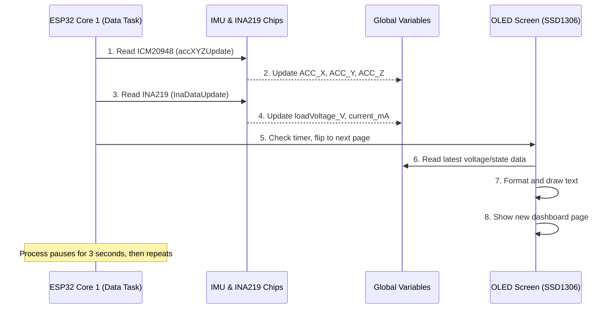

# Chapter 7: Hardware Data Acquisition and Display

In [Chapter 6: Kinematics and Motion Engine](06_kinematics_and_motion_engine_.md), we learned how the ESP32 uses complex math to make WAVEGO walk smoothly. But for the robot to operate safely and effectively, it needs to know what's happening *inside* its own body.

Is the battery about to die? Is the robot leaning too far over?

This chapter introduces the **Hardware Data Acquisition and Display** module. This system's job is to read data from the physical sensors attached to the ESP32 and display that crucial information on the small OLED screen, acting as the robot's heads-up dashboard.

## The Goal: Knowing the Robot's Status

Imagine WAVEGO is walking on a rough floor. The core goal of this module is to continuously monitor key internal metrics:

1.  **Orientation:** Is the robot balanced? (IMU Sensor)
2.  **Power:** How much battery life is left? (INA219 Sensor)
3.  **Display:** Show the information clearly and instantly. (OLED Screen)

This process involves talking to specific hardware chips using the standard communication method called **I2C**.

## 1. The Sensor Hardware

The ESP32 uses a dedicated set of wires (SDA and SCL) to talk to specialized sensor chips.

### A. The IMU (ICM20948)

The **Inertial Measurement Unit (IMU)** is like the robot's inner ear. It measures acceleration, rotation, and magnetic fields. For basic balance, we primarily focus on **Acceleration (ACC)**, which tells us how quickly the robot is moving or tilting along the X, Y, and Z axes.

| Axis | What it Measures |
| :--- | :--- |
| **X** | Tilt side-to-side (Left/Right) |
| **Y** | Tilt front-to-back (Forward/Backward) |
| **Z** | Up/Down movement (Gravity) |

The IMU library provides a function, `accXYZUpdate()`, that reads the latest data and stores it in global variables: `ACC_X`, `ACC_Y`, and `ACC_Z`.

```cpp
// Arduino/WAVEGO/InitConfig.h (Simplified Update)

extern float ACC_X;
// ... other global variables ...

void accXYZUpdate(){
  myIMU.readSensor(); 
  // Get raw readings from the IMU chip
  xyzFloat corrAccRaw = myIMU.getCorrectedAccRawValues(); 

  // Store the raw acceleration values
  ACC_X = corrAccRaw.x;
  ACC_Y = corrAccRaw.y;
  ACC_Z = corrAccRaw.z;
}
```

### B. The Power Monitor (INA219)

The **INA219** is the dedicated battery monitoring chip. It provides precise information about the electrical power flowing through the robot.

| Measurement | Description | Variable |
| :--- | :--- | :--- |
| **Load Voltage** | The actual battery voltage (crucial for safety). | `loadVoltage_V` |
| **Current** | How much electricity is being used (Amps/milliamps). | `current_mA` |
| **Power** | Total power consumption. | `power_mW` |

The `InaDataUpdate()` function performs the reading:

```cpp
// Arduino/WAVEGO/InitConfig.h (Simplified Power Update)

extern float loadVoltage_V; 
extern float current_mA;

void InaDataUpdate(){
  // Request data from the INA219 chip
  shuntVoltage_mV = ina219.getShuntVoltage_mV();
  busVoltage_V = ina219.getBusVoltage_V();
  current_mA = ina219.getCurrent_mA();
  
  // Calculate final load voltage
  loadVoltage_V  = busVoltage_V + (shuntVoltage_mV/1000);
}
```

## 2. The OLED Display (SSD1306)

The OLED screen is a small, black-and-white display that sits on the robot's head. It uses the same I2C connection as the sensors.

Since the screen is small, we cannot display all system information at once. The code uses a "dashboard" approach, flipping through different pages of information automatically every few seconds.

This dashboard is managed by the `allDataUpdate()` function, which acts as the main display loop.

### A. Page Cycling

The system uses `CURRENT_PAGE` to track which screen to show. It automatically increments this page number every 3000 milliseconds (3 seconds), controlled by the `PAGE_FLASH` variable.

```cpp
// Arduino/WAVEGO/InitConfig.h (Simplified Page Check)

extern int CURRENT_PAGE = 1;
extern int PAGE_NUM = 2; // We have 2 main pages
extern int PAGE_FLASH = 3000;

void allDataUpdate(){
  // Check if 3000ms have passed since the last update
  if(millis() - LAST_FLASH > PAGE_FLASH){
    CURRENT_PAGE += 1;
    if(CURRENT_PAGE > PAGE_NUM){
      CURRENT_PAGE = 1; // Loop back to Page 1
    }
    LAST_FLASH = millis();

    // ... Run InaDataUpdate() and update screen ...
  }
  // ...
}
```

### B. Displaying Status (Page 1)

Page 1 is the most important status screen. It shows the connectivity, the current movement state, and the battery level.

When `CURRENT_PAGE == 1`, the code prints the collected data to the screen buffers:

```cpp
// Arduino/WAVEGO/InitConfig.h (Simplified Page 1 Display)

if(CURRENT_PAGE == 1){
  // Example: Display connection status (from other modules)
  display.print(F("[AP] ")); display.println(IP_ADDRESS);
  display.print(F("[RSSI] ")); display.println(WIFI_RSSI);

  // Display current movement flags (from Chapter 3)
  display.print(F("[FB]"));display.print(moveFB); 
  display.print(F(" [LR]"));display.print(moveLR);

  // Display the battery data we just acquired
  display.print(F("[BATTERY] "));display.println(loadVoltage_V);
}
display.display(); // Push the buffer content to the physical screen
```
The screen now shows you in real-time if the robot is currently commanded to move forward (`FB:1`) and if the battery voltage (`loadVoltage_V`) is safe.

## 3. Sensor Acquisition and Display Flow

Since the ESP32 is a multi-tasking chip, the sensor reading and display updates happen in a specific background process to avoid interfering with the time-sensitive Kinematics Engine (Chapter 6).

The `dataUpdateHandle` uses a process called **FreeRTOS tasking** to ensure the display updates run smoothly on a separate processor core (`ARDUINO_RUNNING_CORE`).

Here is the simplified flow of how the data is collected and displayed:



## 4. Using the Sensor Data

While the OLED is great for human viewing, the main benefit of data acquisition is enabling the robot to act on the information internally.

### A. Power Monitoring

The `loadVoltage_V` is critical for safety. If the voltage drops too low (indicating an almost dead battery), the robot should stop moving to protect the electronics. The main loop monitors this:

```cpp
// Arduino/WAVEGO/ServoCtrl.h (Conceptual Safety Check)
extern float loadVoltage_V; 
#define LOW_VOLTAGE_THRESHOLD 6.5 // Volts

void robotCtrl(){
  // ... (Gait cycle runs here) ...
  
  // Safety check: Is the battery too low?
  if (loadVoltage_V < LOW_VOLTAGE_THRESHOLD){
    Serial.println("LOW BATTERY: EMERGENCY STOP");
    moveFB = 0; // Force stop movement
    // ... possibly sound buzzer ...
  }
}
```

### B. Orientation Feedback

The acceleration data (`ACC_X`, `ACC_Y`, `ACC_Z`) can be used to stabilize the robot or help it recover from a fall. Although WAVEGO uses a primarily kinematic (math-based) control model (Chapter 6), advanced routines could use the IMU data as feedback to adjust leg positions dynamically, ensuring the body remains level even when walking on slopes.

## Conclusion

The **Hardware Data Acquisition and Display** module is the eyes and ears of the ESP32, providing crucial feedback on the robot's physical status. By utilizing the I2C bus, it collects real-time data from the IMU (ICM20948) for orientation and the INA219 for power monitoring. This data is then formatted and displayed on the small OLED screen (SSD1306) and, more importantly, used internally by the control logic for safety checks and potential stabilization routines.

This chapter concludes our detailed look into all the core software abstractions that make WAVEGO work, from remote control to walking mechanics and sensor feedback.

---
